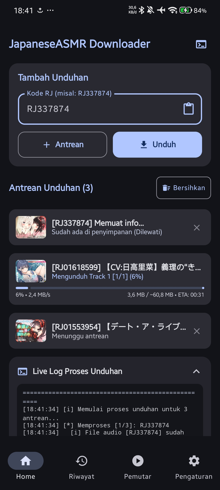
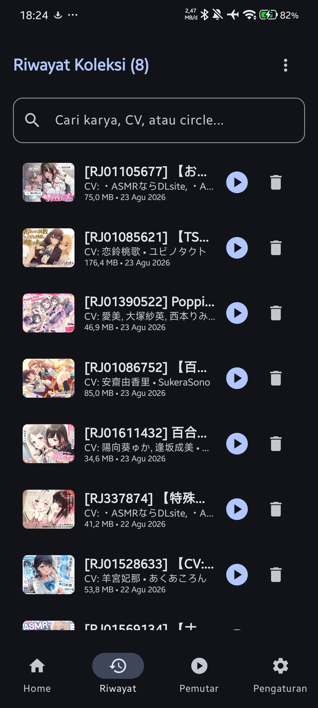
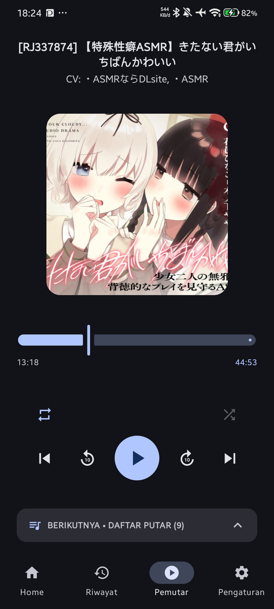
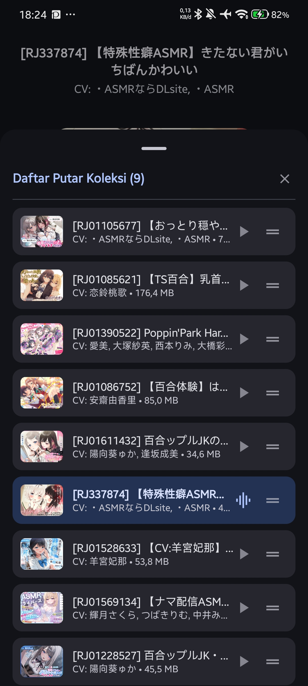
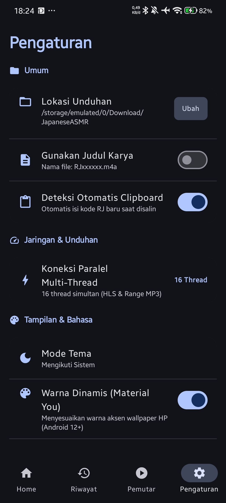
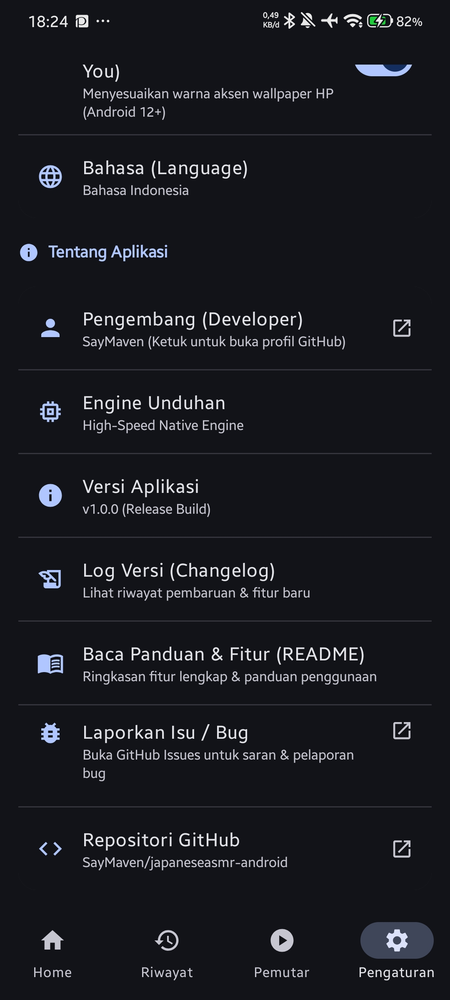

<div align="center">
  
  <h1>JapaneseASMR Downloader</h1>
  <p><b>A high-performance native Android application for downloading, managing, and playing Japanese ASMR audio works.</b></p>

  <p>
    <a href="https://github.com/SayMaven/japaneseasmr-android/releases/latest"></a>
    <a href="https://github.com/SayMaven/japaneseasmr-android/blob/main/LICENSE"></a>
    
    
    
  </p>

  <p>
    <a href="#features">Features</a> •
    <a href="#screenshots">Screenshots</a> •
    <a href="#download">Download</a> •
    <a href="#building-from-source">Building</a> •
    <a href="#architecture">Architecture</a> •
    <a href="#license">License</a>
  </p>
</div>

---

## Overview

JapaneseASMR Downloader is a full-featured, open-source Android application engineered specifically for downloading, archiving, and listening to Japanese ASMR voice dramas (RJ Works). Built from the ground up with Jetpack Compose, Kotlin Coroutines, Room Database, and AndroidX Media3 (ExoPlayer), the app delivers desktop-grade streaming performance, zero-OOM memory safety, and seamless background audio playback on mobile devices.

---

## Screenshots

<div align="center">
  
  
  
  <br />
  
  
  
</div>

---

## Features

### High-Speed Download & Stream Demuxing Engine
* **Concurrent Parallel Connections**: Multi-threaded segment downloader supporting 4 to 32 parallel connections (default 16) for line-speed performance.
* **Zero-RAM Disk-Streaming Pipeline**: Stream demuxing directly to flash storage, enabling safe handling of multi-gigabyte audio tracks without risking `OutOfMemoryError`.
* **Standard Audio Remuxing**: Native ISO M4A / AAC container packaging ensuring complete seekability (0-second timeline scrubbing) across third-party audio players (Poweramp, HiBy Music, VLC, Google Files, etc.).
* **Automatic Storage Deduplication**: Detects existing files in your download folder and automatically skips redundant network requests.
* **Persistent Live Console**: Real-time progress monitoring, transfer speed calculation, and estimated completion time (ETA) with a persistent toggle button (`>_` / `</>`).

### Integrated Native Audio Player
* **Android MediaSession Integration**: Foreground audio playback service with rich notification controls and lock screen artwork display.
* **Dedicated Audio Player Settings**: Configurable auto-resume playback, keep screen on, USB DAC exclusive bit-perfect mode, and custom download directory.
* **Replay 10s & Forward 10s Controls**: Quick jump controls for navigating audio dialogue and chapters effortlessly.
* **Persistent Timeline Mode**: Toggling between total elapsed duration and remaining time (`-mm:ss`) persists across app restarts.
* **GPU Hardware-Accelerated ASMR Breathing Wave**: Calm, slow-tempo dynamic equalizer animation on active tracks in the playlist drawer.
* **Continuous Fluid Drag-and-Drop**: Multi-track dynamic reordering in the playlist bottom drawer with immediate playback queue synchronization and dedicated touch drag handles.
* **Strict Physical File Validation**: Automatically hides missing files in the playlist collection and refreshes in real-time when audio files are restored to storage.

### Library & Metadata Management
* **Realtime Storage Synchronization (StorageSyncManager)**: Automatically scans physical storage on launch/resume, synchronizing new, moved, or deleted audio files with the local Room database.
* **Smart Sorting Filters**: Instant ordering by Date (Newest / Oldest) with real millisecond timestamp precision and Title (A-Z / Z-A) with rock-solid list anchoring at index 0.
* **Uniform Date Formatting**: Clean, standardized date strings (`dd MMM yyyy`) across the entire app.
* **Complete Metadata Tagging**: Embeds high-resolution cover artwork, Voice Actor (CV), Circle/Author, Work Title, and Genre tags directly into audio files (ID3v2 / MP4 atom).
* **Search & Collection Filtering**: Search your offline library by RJ Code, title, voice actor, or circle.

### Modern Material Design 3 UI & Theming
* **Dynamic Material You / Monet Engine**: Automatic color palette generation based on Android 12+ wallpaper colors.
* **36 Curated Color Palettes**: Comprehensive theme selection with 3-segment circle previews, smooth horizontal carousel, and 9-dot pagination.
* **0ms Instant Startup Fast Cache**: Synchronous caching of theme preferences eliminates cold start dynamic color flicker.
* **Instant 0ms Tab Switching**: Retained GPU RenderNode layer architecture for zero-delay switching across Home, History, Player, and Settings.
* **System, Dark, and Light Modes**: Full day/night theme support with smooth transitions.

---

## Architecture & Tech Stack

JapaneseASMR Downloader adheres strictly to Modern Android Architecture guidelines with separation of concerns and reactive data flow:

| Layer | Component | Description |
| :--- | :--- | :--- |
| **UI Layer** | Jetpack Compose + Material 3 | Declarative UI, Animations, Custom Theming |
| **State Management** | Kotlin Coroutines + StateFlow | Reactive, lifecycle-aware unidirectional data flow |
| **Media Player** | AndroidX Media3 (ExoPlayer) | Native audio decoding, MediaSession, Foreground Service |
| **Local Database** | Room Database (SQLite) | Local library persistence, query caching, reactive observers |
| **Preferences** | AndroidX DataStore + SharedPreferences Fast Cache | Type-safe persistence with 0ms synchronous startup cache |
| **Networking** | OkHttp 4 | HTTP/2 connection pooling, multi-thread segment downloads |
| **Audio Tagging** | Jaudiotagger | ID3v2, MP4 atom, and metadata embedding |
| **Image Loading** | Coil Compose | Asynchronous image decoding, memory and disk caching |

---

## Download

Pre-compiled universal release APKs signed with the official SayMaven certificate are available on the GitHub Releases page:

[**Download Latest Release (GitHub Releases)**](https://github.com/SayMaven/japaneseasmr-android/releases/latest)

---

## Building from Source

### Prerequisites
* JDK 17 or higher
* Android SDK with Build Tools 35.0.0+
* Gradle 8.7+ (included via Gradle Wrapper)

### Clone and Compile
```bash
# Clone the repository
git clone https://github.com/SayMaven/japaneseasmr-android.git
cd japaneseasmr-android

# Compile Debug APK
./gradlew assembleDebug
```

The compiled APK will be located at:
```
app/build/outputs/apk/debug/JapaneseASMR-v1.x.x-debug.apk
```

---

## Disclaimer

This software is developed strictly for personal, educational, and backup archiving purposes. The developer does not host, distribute, or promote copyrighted media. Users are solely responsible for ensuring compliance with applicable copyright laws and service terms in their jurisdiction.

---

## License

This project is licensed under the [GNU General Public License v3.0 (GPL-3.0)](LICENSE).
